## Features Testing
Note: User Stories aspects of some Features are covered in the User Stories Testing section. [User Stories Testing](#User-stories-testing)

### Budgeting Software
Description: View and create Budgets for the "All in One Platform" or the separate Budgeting Software. 

- Use Case: Access the Budget for the "All in One Platform" or the separate Budgeting Software 

  1. Click on the My Account link in the Navbar. 
  2. The Account page opens displaying all the Platform products and separate Budgeting Software products purchased with a "Budget" tab displaying. 
  3. Click on the Budget tab and a new empty Budget Detail page opens with the Create Budget, "Cover Page" and "Top Sheet" tabs displaying on top. 

 <strong>"All in One Platform" products</strong>

<h2 align="center">
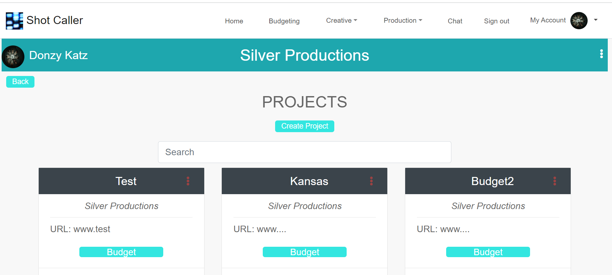
</h2>

 <strong>Separate Budgeting Software products</strong>

<h2 align="center">

</h2>

 <strong>New empty Budget page</strong>

<h2 align="center">

</h2>

- Use Case: Initialize the Budget 

  1. Click on the "Create Budget" tab to open the Create Budget page. 
  2. Input production details in one or as many fields as desired at this moment and click "Create". 
  3. The newly created Budget Detail page opens displaying the new details inputted. 
  3. An "Edit Budget" tab has now replaced the "Create Budget" tab.

 <strong>Input production details</strong>

<h2 align="center">
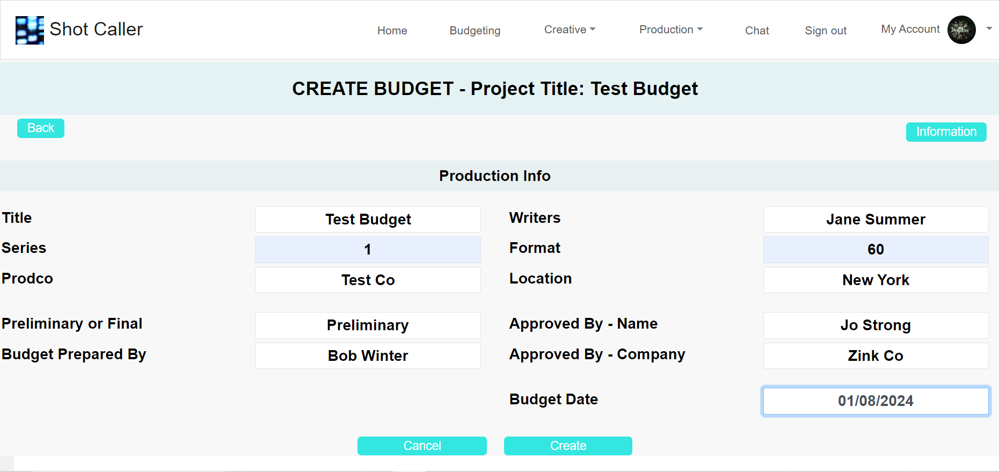
</h2>

 <strong>Newly Created Budget Detail page</strong>

<h2 align="center">
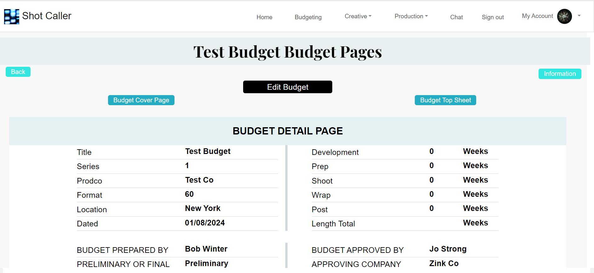
</h2>

- Use Case: Input Budget values by Section 

  1. Click the "Edit Button" to open the Edit Budget page. 
  2. Below the Production Details section the Above the line, Below the Line Labour, Below the Line Costs, Post Production and Other titles display with their current totals each containing the titles of their respective sections also with their current totals displaying. 
  3. More Totals including the "Grand Total" display below. 
  4. Click on a section title, "Visual Effects" and its form opens below. 

 <strong>Budget Sections and Totals</strong>

<h2 align="center">
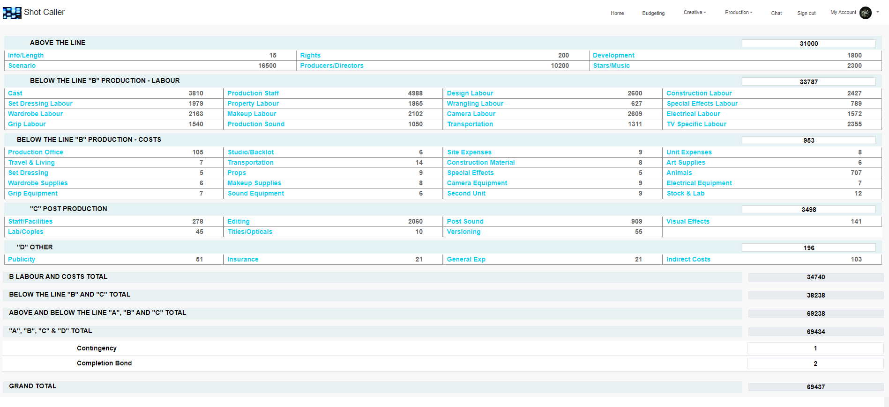
</h2>

 <strong>Visual Effects Form opens after clicking its Section Title</strong>

<h2 align="center">

</h2>

[Back to README](/README.md)

- Use Case: Add/Edit values to an "Above the Line" section 

  1. Add/Edit input values to the Edit page "Pre-Production & Development" section. 
  2. The Edit page Totals change with each input. 

 <strong>The "Pre-Production & Development" Section with Inputs and Total</strong>

<h2 align="center">
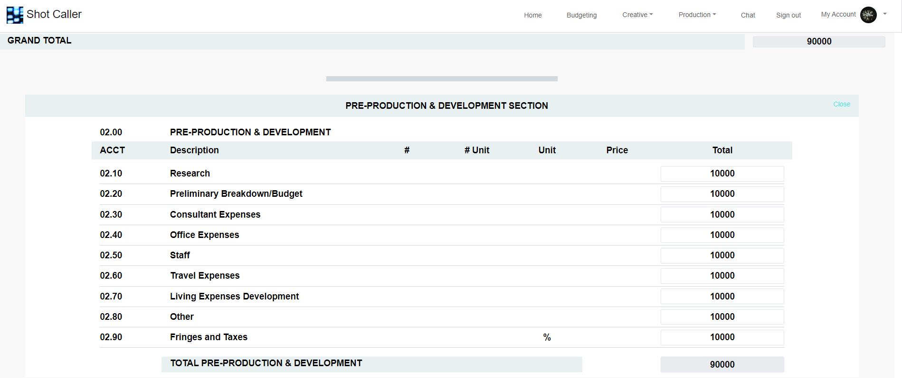
</h2>

 <strong>The Edit page Sections Titles and the Totals Showing the Changes</strong>

<h2 align="center">
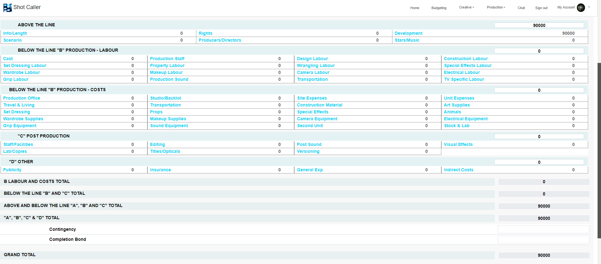
</h2>

- Use Case: Add/Edit values to a "Below the Line Labour" section 

  1. Add/Edit input values to the Edit page "Electrical Labour" section. 
  2. Each crew member's Prep, Shoot and Wrap total is calculated from the number of crew in the role and the number of Weeks and the Rate.
  2. The Edit page Totals change with each input.  

 <strong>The "Electrical Labour" Section with Inputs and Total - top half</strong>

<h2 align="center">
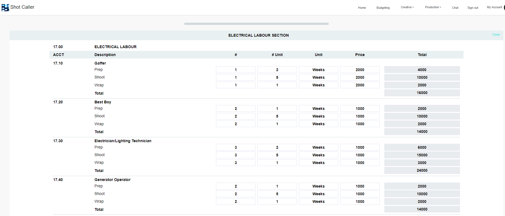
</h2>

 <strong>The "Electrical Labour" Section with Inputs and Total - bottom half</strong>

<h2 align="center">
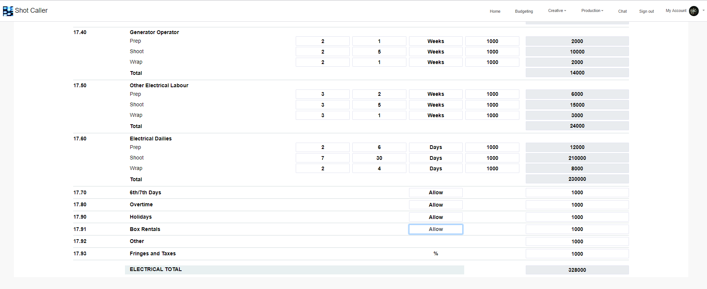
</h2>

 <strong>The Edit page Sections Titles and the Totals Showing the Changes</strong>

<h2 align="center">
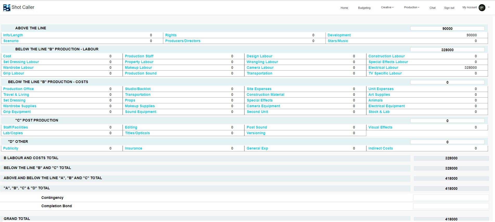
</h2>

[Back to README](/README.md)

- Use Case: Add/Edit values to an ""Below the Line Costs" section 

  1. Add/Edit input values to the Edit page "Pre-Production & Development" section. 
  2. The Edit page Totals change with each input. 

 <strong>The "Construction Material" Section with Inputs and Total</strong>

<h2 align="center">
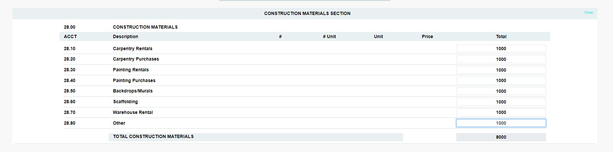
</h2>

 <strong>The Edit page Sections Titles and the Totals Showing the Changes</strong>

<h2 align="center">
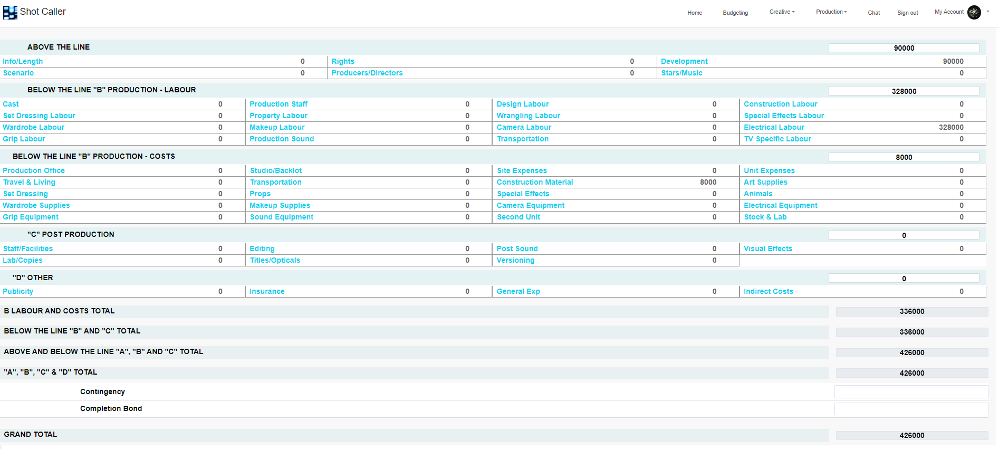
</h2>

- Use Case: Add/Edit values to a "Post Production" section 

  1. Add/Edit input values to the Edit page "Editing" section. 
  2. The Edit page Totals change with each input. 

 <strong>The "Editing" Section with Inputs and Total</strong>

<h2 align="center">
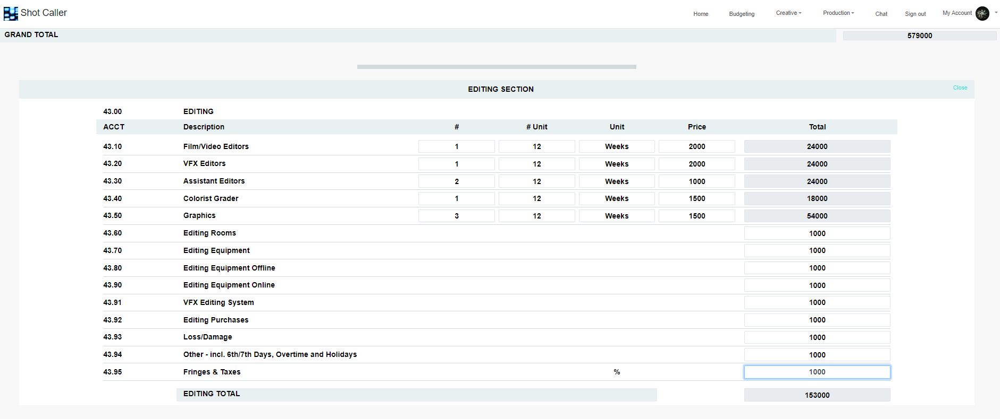
</h2>

 <strong>The Edit page Sections Titles and the Totals Showing the Changes</strong>

<h2 align="center">
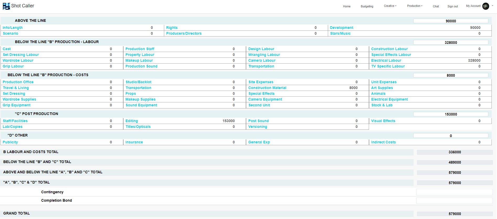
</h2>

- Use Case: Add/Edit values to an "Other" section 

  1. Add/Edit input values to the Edit page "Publicity" section. 
  2. The Edit page Totals change with each input. 

 <strong>The "Publicity" Section with Inputs and Total</strong>

<h2 align="center">
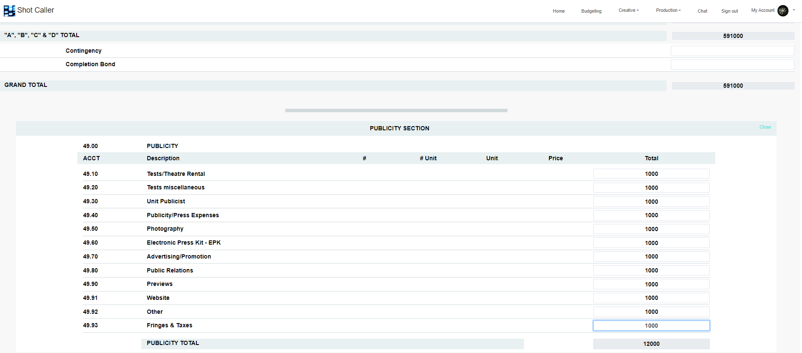
</h2>

 <strong>The Edit page Sections Titles and the Totals Showing the Changes</strong>

<h2 align="center">
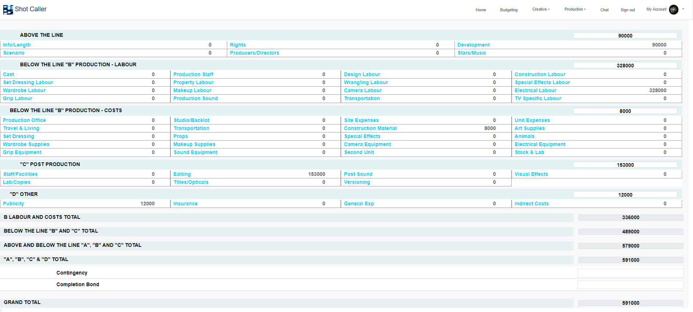
</h2>

- Use Case: Add/Edit values to the "Contingincy" and "Bond" inputs 

  1. Add/Edit input values to the Edit page "Contingincy" and "Bond" inputs. 
  2. The Edit page "Grand Total" changes with each input. 

 <strong>The Contingincy and Bond inputs and Grand Total showing the changes</strong>

<h2 align="center">
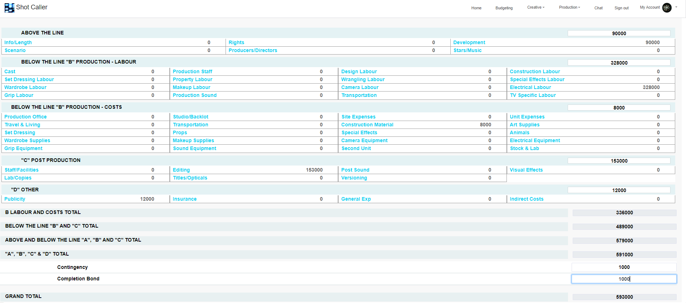
</h2>

[Back to README](/README.md)

- Use Case: Create the Budget Detail page with all the values inputted and calculated on the edit page 

  1. Submit the Edit page with all the newly added changes. 
  2. The Budget Detail page displays all above imputs showing correctly. 

 <strong>The "Details" and "Totals" match the Edit page ones which were submitted</strong>

<h2 align="center">
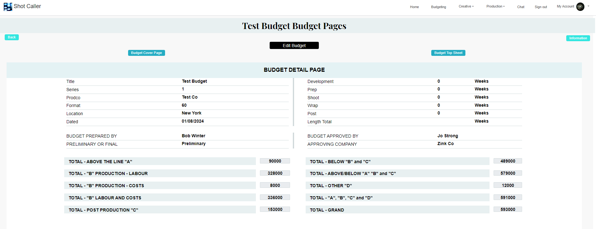
</h2>

 <strong>The "Pre-Production & Development" values match the Edit pages ones which were submitted</strong>

<h2 align="center">

</h2>

 <strong>The "Electrical Labour" values match the Edit page ones which were submitted</strong>

<h2 align="center">

</h2>

 <strong>The "Construction Material" values match the Edit page ones which were submitted</strong>

<h2 align="center">
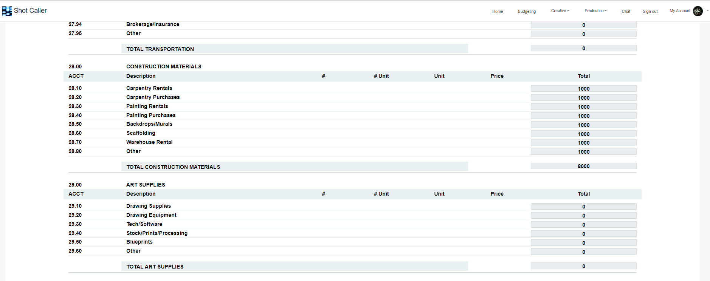
</h2>

 <strong>The "Editing" values match the Edit page ones which were submitted</strong>

<h2 align="center">
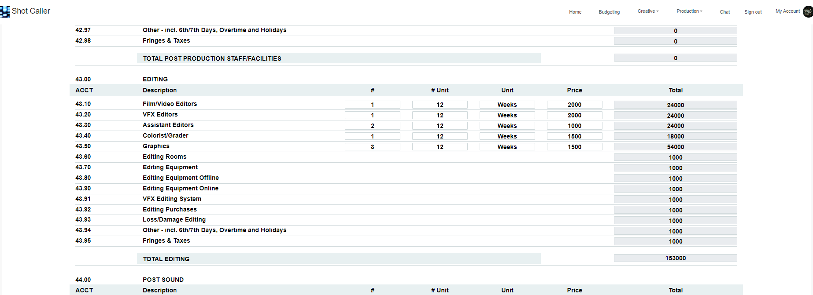
</h2>

 <strong>The "Publicity" values match the Edit page ones which were submitted</strong>

<h2 align="center">
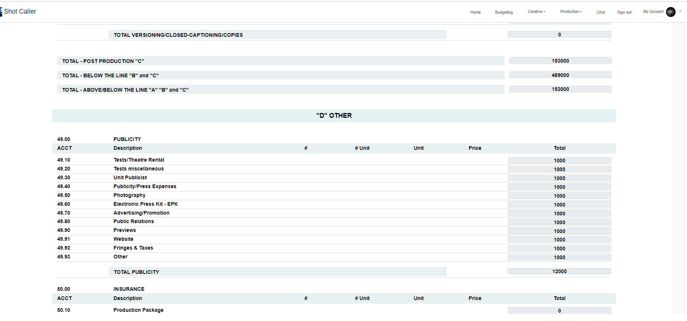
</h2>

 <strong>The "Contingincy" and "Bond" inputs and the Totals match the Edit page ones which were submitted</strong>

<h2 align="center">
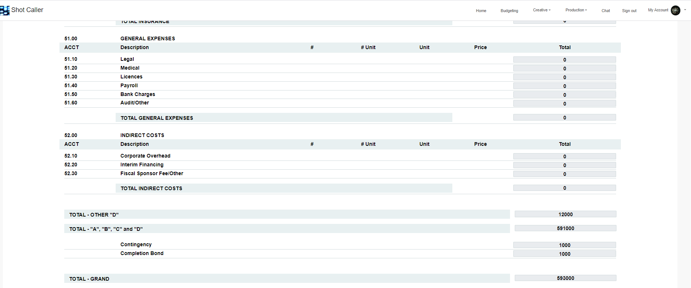
</h2>

- Use Case: Create the Budget Cover Page displaying the values inputted on the Edit page 

  1. Submit the Edit page with all the newly added changes including the production title "Test budget". 
  2. Click the "Budget Cover Page" tab.
  2. The "Budget Cover Page" opens displaying all above imputs correctly including the production title "Test budget". 

 <strong>Budget Cover Page</strong>

<h2 align="center">
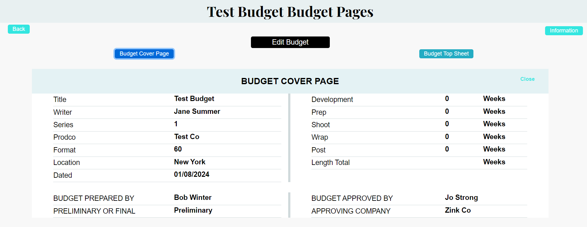
</h2>

- Use Case: Create the Budget Top page with all the values calculated on the Edit page 

  1. Submit the Edit page with all the newly added changes. 
  2. Click the "Budget Top Sheet" tab.
  2. The "Budget Top Sheet" displays all above values showing correctly. 

 <strong>Budget Top Sheet</strong>

<h2 align="center">
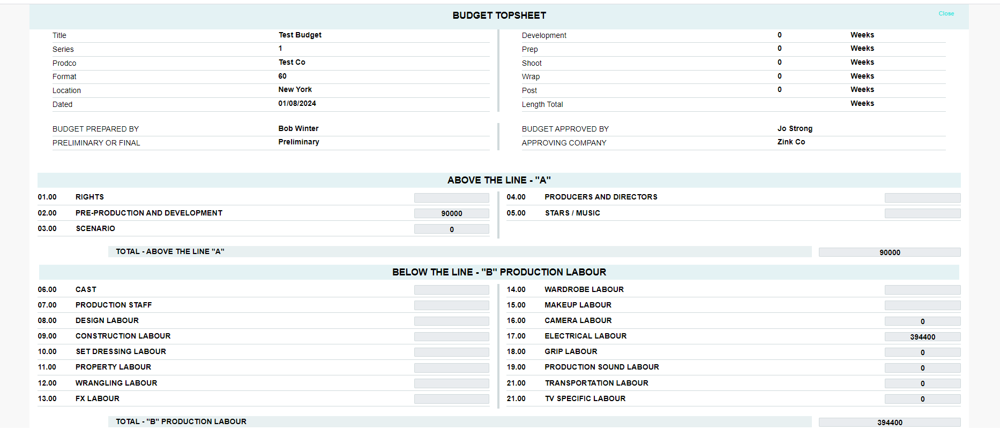
</h2>
<h2 align="center">
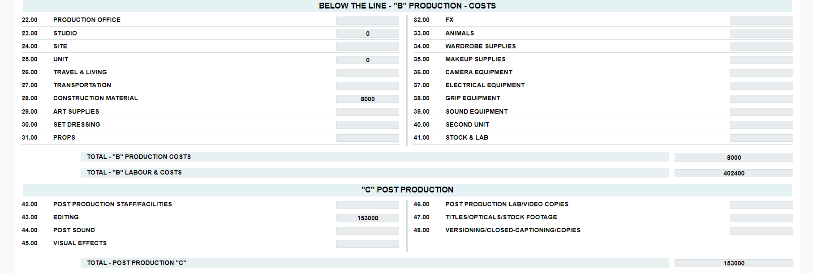
</h2>
<h2 align="center">
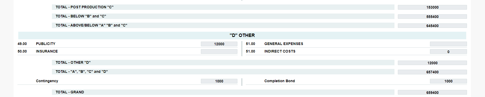
</h2>

[Back to README](/README.md)

- Use Case: Use the "Globals" feature to give the Crew's production work's "Weeks Length" a universal value for their "Prep", "Shoot" and "Wrap" inputs 

  1. On the Edit page click on the "Globals" tab. 
  2. The "Globals" form opens. 
  3. Input the values "2.2" in the "Prep" input, "7.6" in the "Shoot" input and "3.4" in the "Wrap" input. One, two or all three may be set.  
  4. Click set. 
  5. The Globals are added to the correct Edit page inputs. 

 <strong>Input and Set the "Prep", "Shoot" and "Wrap" Globals </strong>

<h2 align="center">
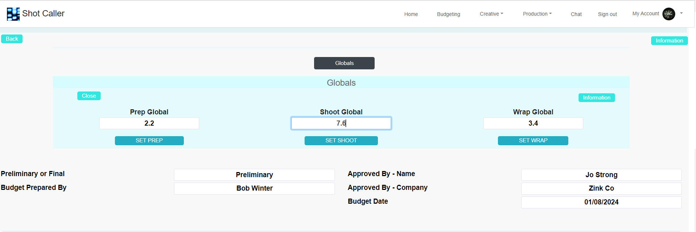
</h2>

 <strong>The Globals added to the empty inputs in the Camera Labour section</strong>

<h2 align="center">
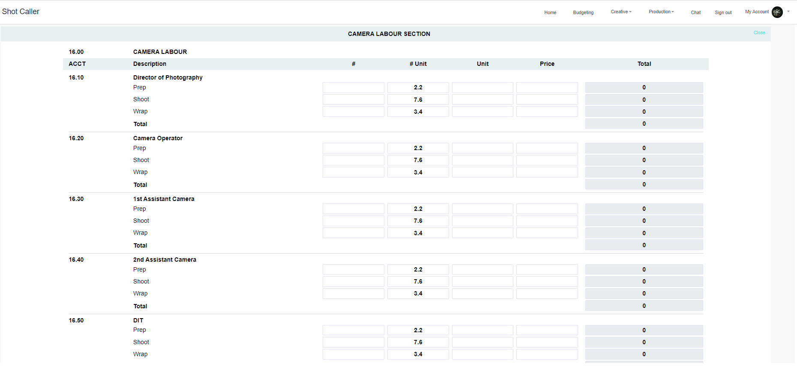
</h2>

 <strong>The Glodals updated the pre-existing values in the Electrical Labour section and the totals re-calculated instantly</strong>

<h2 align="center">
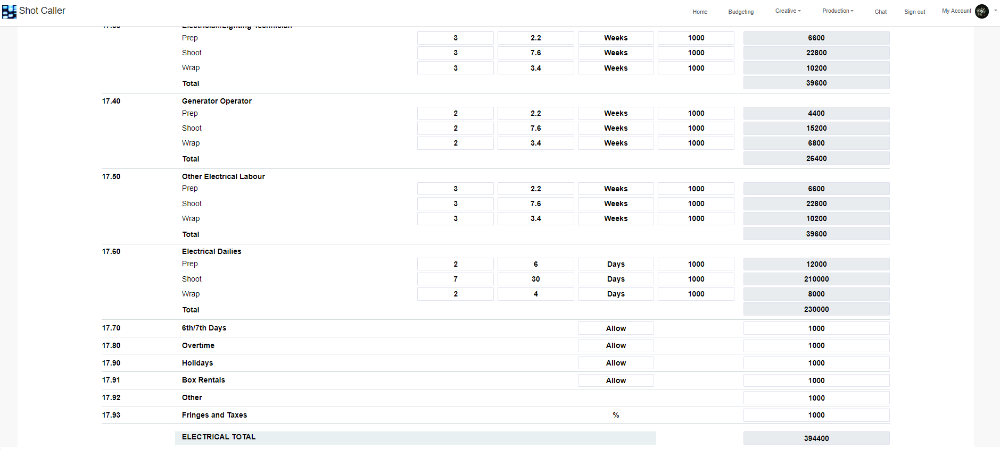
</h2>

 <strong>The Edit page updated totals after setting the Globals</strong>

<h2 align="center">
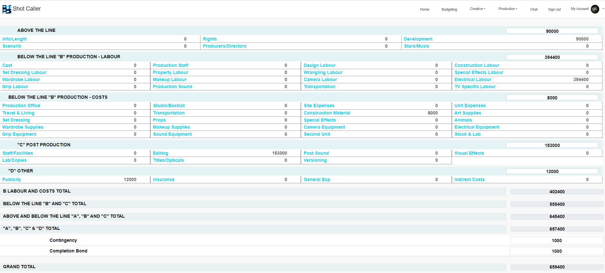
</h2>

 <strong>The Budget Detail page's updated totals after setting the Globals and submiting the Edit page</strong>

<h2 align="center">
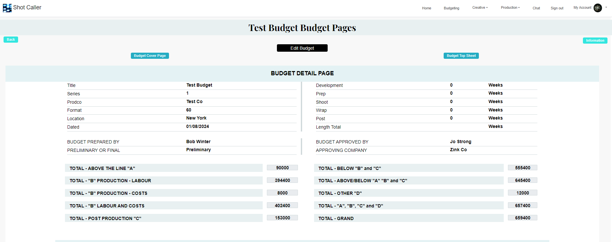
</h2>

- Use Case: Download or Print the finished Budget 

  1. Click on the "Download" icon on the Budget page and the Budget is downloaded. 
  1. Click on the "Print" icon on the Budget page and the Budget is printed out. 

 <strong>xxx</strong>

<h2 align="center">

</h2>

[Back to README](/README.md)

### Login/Register/Logout Pages
Description: Django Rest Frameworks is used for the backend and has built in register and login functionality which is used when a User registers, logs in or logs out. 

- Use Case: Register an account 

  1. Click on any of the Sign Up/Register links on the Home page or the one in the Navbar. 
  2. The Register page opens. 
  3. Enter a Username, Email, Password and Confirm Password and submit. 
  4. The Sign In page opens and on entering the Username and Password the Home page opens, (see image for Sign In page below)  

 <strong>Sign Up Page</strong>

<h2 align="center">
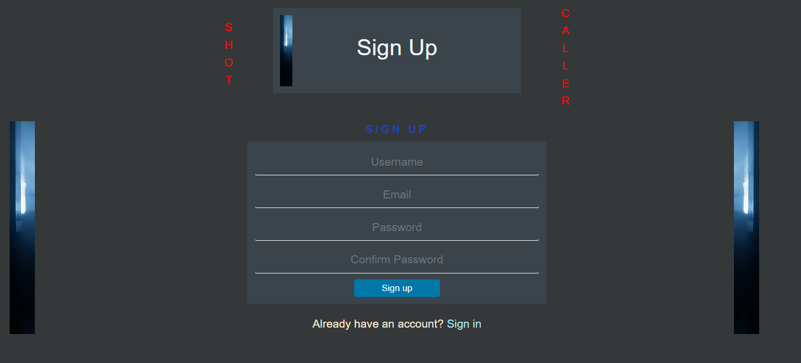
</h2>

- Use Case: Log In 

  1. Click on the Sign In link on the Home page or the one in the Navbar. 
  2. The Sign In page opens. 
  3. Enter a Username and Password and submit. 
  4. The Home page opens. 

 <strong>Sign In Page</strong>

<h2 align="center">

</h2>

- Use Case: Log Out 

  1. Click on the Sign Out tab in the Navbar. 
  2. The User is signed ot and the Sign In page opens. 

### Edit Profile/Change Username/Change Password/Forgot Password

- Use Case: Edit User profile.  

  1. Click on the My Account link and the Account page opens. 
  2. Click the 3 Dots and a menu appears. Select Edit profile. 
  3. Enter the new info and an image and submit. 
  4. The new info and image display. 

 <strong>New Info</strong>

<h2 align="center">
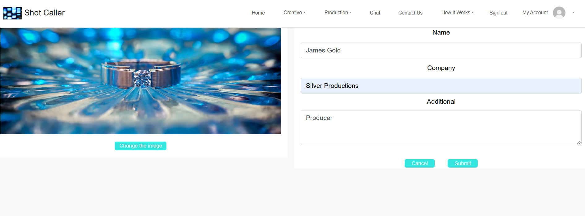
</h2>

 <strong>New Info Displays</strong>

<h2 align="center">
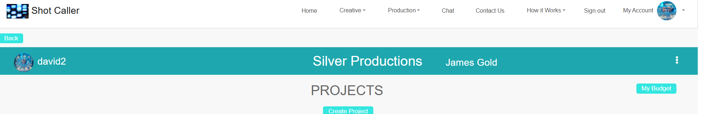
</h2>

- Use Case: Change Username.  

  1. Click on the My Account link and the Account page opens. 
  2. Click the 3 Dots and a menu appears. Select Change Username. 
  3. Enter the new Username and submit. 
  4. The new Username display correctly and on logging out and signing in with that Username the User is taken to the Home page. The old username no longer is valid. 
  5. This has no effect on the Username for Projects.

 <strong>New Username</strong>

<h2 align="center">
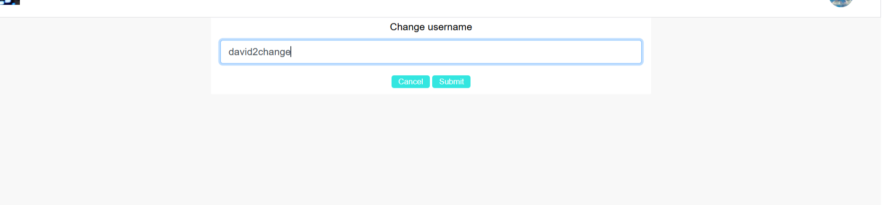
</h2>

 <strong>New Username Displays</strong>

<h2 align="center">

</h2>

 <strong>On Logging In</strong>

<h2 align="center">
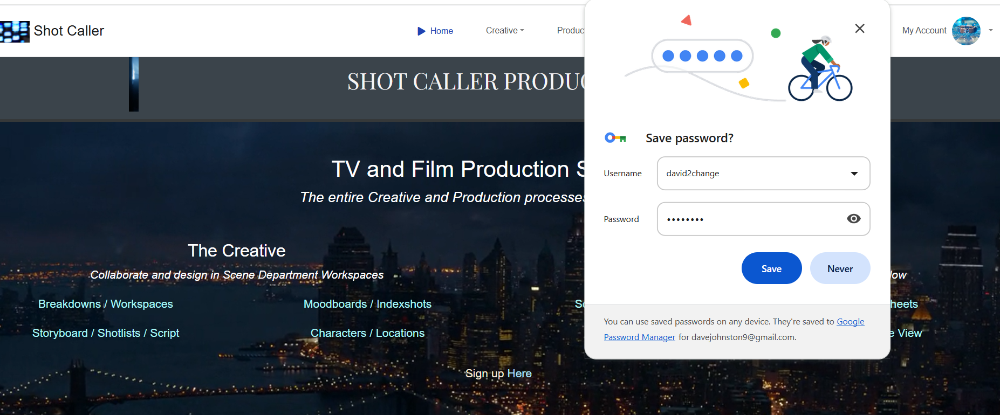
</h2>

- Use Case: Change Password.  

  1. Click on the My Account link and the Account page opens. 
  2. Click the 3 Dots and a menu appears. Select Change Password. 
  3. The Change Password form opens. Enter the new Password and submit. 
  4. On logging out and signing in with that Password the user is taken to the Home page. The old Password no longer is valid. 
  5. This has no effect on the Passwords for Projects which still use their own one.

 <strong>New Password</strong>

<h2 align="center">
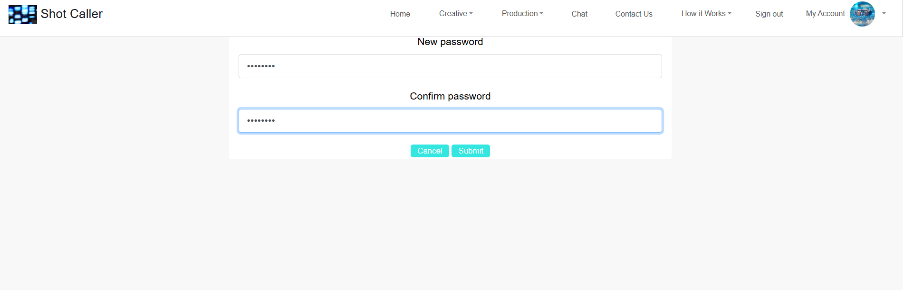
</h2>

 <strong>Password is Updated</strong>

<h2 align="center">
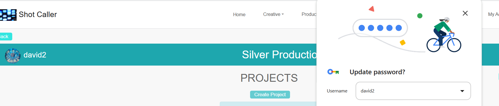
</h2>

 <strong>Old Password no Longer Valid</strong>

<h2 align="center">
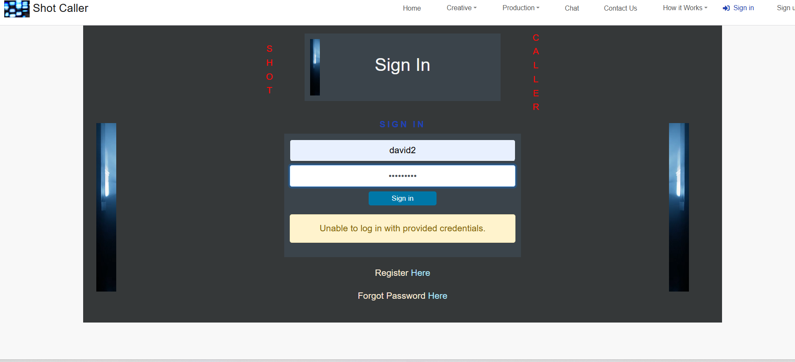
</h2>

 <strong>New Password has no Effect on the Project's Passwords</strong>

<h2 align="center">
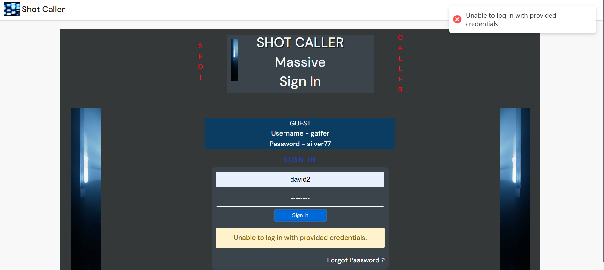
</h2>

- Use Case: Forgot Password.  

  1. Click the "Forgot Password" link on the Sign In and the Forgot Password page opens. 
  2. Enter the correct email for the account and submit. 
  3. A message appears on top saying that a Reset password Link has been sent to the email address. 
  4. On clicking on the link the Reset password page opens. 
  4. Enter the new password but enter a different one for the confirm password field and submit. 
  4. An error message displays saying the passwords don't match. 
  4. Enter the new password and the same one for the confirm password field and submit. 
  4. A message displays saying that the password is successfully reset. 
  4. On using it to log in the user is logged in successfully and taken to the Home page. 
  5. This has no effect on the Passwords for Projects which still use their own one.

 <strong>Forgot Password</strong>

<h2 align="center">
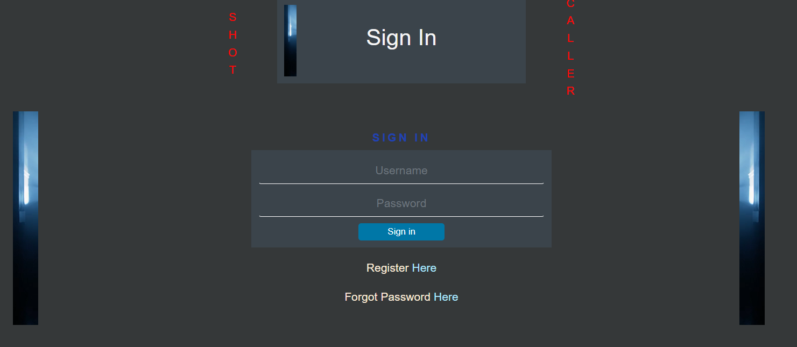
</h2>

 <strong>Reset Message</strong>

<h2 align="center">
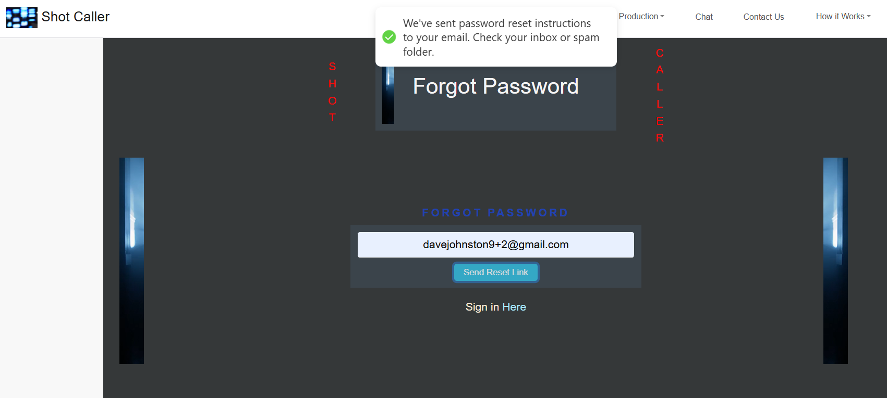
</h2>

 <strong>The Email</strong>

<h2 align="center">
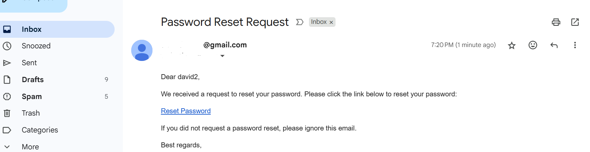
</h2>

 <strong>Error message for Mismatched Passwords</strong>

<h2 align="center">
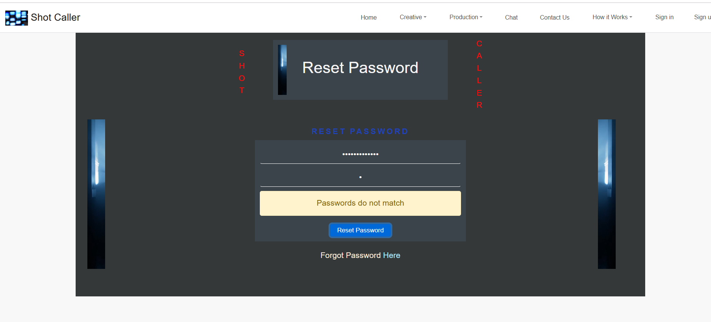
</h2>

 <strong>Password Succcessfully Reset</strong>

<h2 align="center">
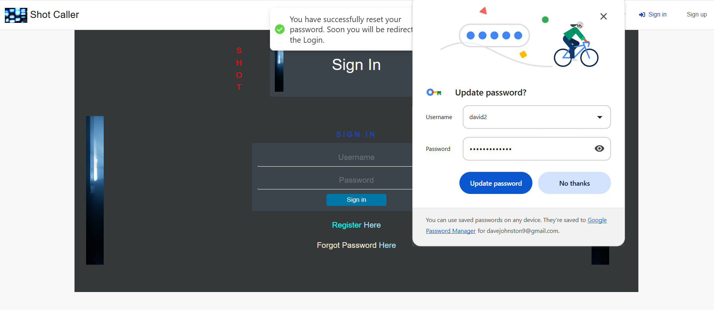
</h2>

 <strong>Logged In Successfully Using the New Password</strong>

<h2 align="center">
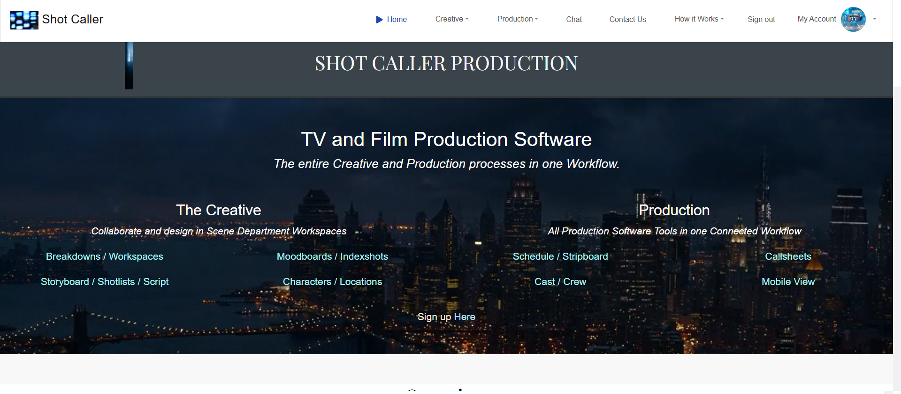
</h2>

### Security
Description: Django Rest Frameworks is used for the backend and has its own security checks dealing with Permissions and Authorisations. The site also uses a number of security measures to prevent unauthorised users from accessing pages they do not have permission to, mainly other user's account pages.  

- Use Case: Access an Account without valid Authorisation and not being registered for a different Account. 

  1. Enter an Account URL in the browser without valid Authorisation and click enter, e.g. "...../acccounts/43". 
  2. The screen goes blank apart from a Spiiner. 

 <strong>No Access</strong>

<h2 align="center">
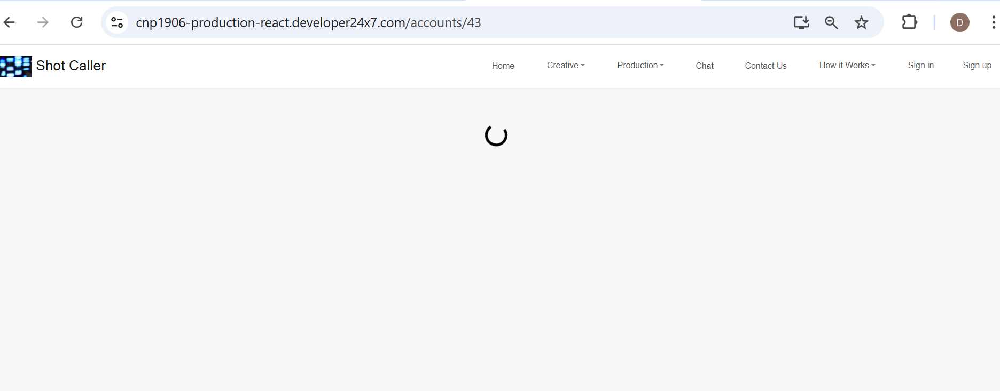
</h2>

- Use Case: Access an Account without valid Authorisation despite being registered for a different Account. 

  1. Enter an Account URL without valid Authorisation in the browser and click enter. 
  2. The screen goes blank apart from a Spinner.  

[Back to README](/README.md)

### The Home Page
Description: This page primarily aims to give the User information about the app and its products and is divided in three sections. First the landing page image which has links to the different information pages and a register link. Secondly a bullet point section giving an overview of the app. The last section has a brief summary of the Creative, Production and Budgeting features and when clicked on takes the user to that feature's information page. 

- Use Case: Find information about the app.  

  1. Enter the site and land on the Home page. 
  2. View information about the app and its products. 

 <strong>xxx</strong>

<h2 align="center">

</h2>

### The Creative, Production and Budgeting Features Explanatory Pages
Description: When a feature link is clicked on in the Navbar, the Home page image or the Home page section the page for that feature opens. It gives a brief concise overview of that feature along with image from the actual software. 

- Use Case: Find information about the Schedule feature.  

  1. Click a Schedule link on the Home page. 
  2. The Schedule information page opens. 

 <strong>Schedule Information Page</strong>

<h2 align="center">
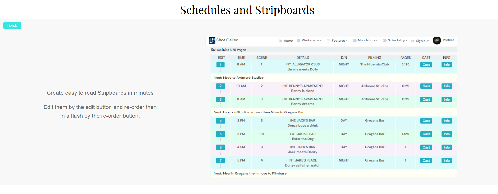
</h2>

[Back to README](/README.md)

### The Subscription Page

- Use Case: View and purchase Platform Subscriptions.  

  1. Click on the Subscription Plans link and the Subscriptions page opens displaying all the plans. 
  2. Click on a Platform Plan and the Stripe page opens. 
  3. Enter you Details but don't tick the Terms and Conditions box and submit. 
  4. A Message appears telling you to tick the bow. 
  5. Tick the box and submit. 
  6. You are taken back to the Subscriptions page and now your plan is active and all lower plans are Unavailable and all higher plans have an Upgrade option. 
  7. An email is sent to you advising you of your plan. 

 <strong>Subscriptions page</strong>

<h2 align="center">
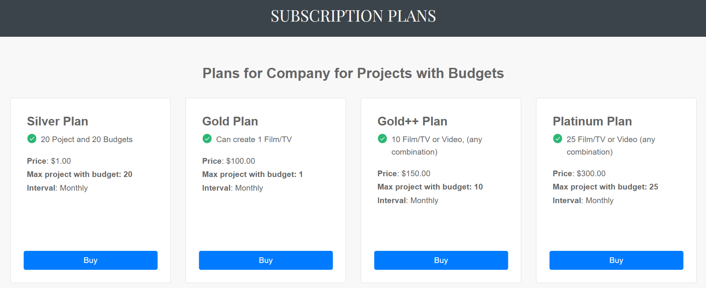
</h2>

 <strong>The Stripe Page Filled In</strong>

<h2 align="center">
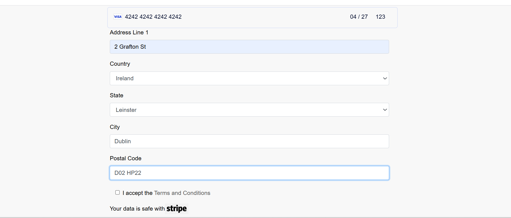
</h2>

 <strong>The tick the Terms and Conditions Box Message</strong>

<h2 align="center">
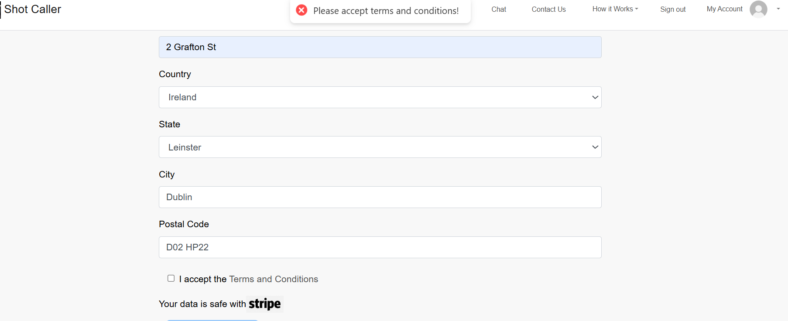
</h2>

<h1>Errors - Upgrade and unavailable need fix replace this image</h1>

 <strong>The Active Plan</strong>

<h2 align="center">
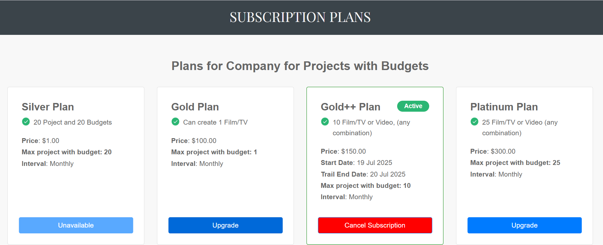
</h2>

 <strong>The Email</strong>

<h2 align="center">
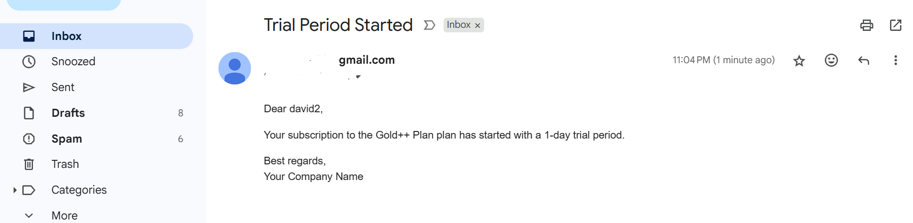
</h2>

- Use Case: Upgrade a Platform product.  

  1. Click on the Subscription Plans link and the Subscription page opens with your current plan, e.g. Gold++. 
  2. Click on a higher Budget Plan you want to upgrade to, e.g. Platinum, and the Stripe page opens. 
  3. Enter you Details and submit. 
  4. You are taken back to the Subscriptions page and now your new plan, Platinum, is active not you old one, and all lower plans are Unavailable and all higher plans would have have an Upgrade option if they were any. 
  5. An email is sent to you advising you of your new plan. 
  6. On the My Account Budget page the message displaying the correct number of remaing Projects and the total for that plan displays correctly, e.g. 39 Projects remaining out of 40.  

<h1>Errors - email wording error - need fix replace this image</h1>

 <strong>Upgrade Email</strong>

<h2 align="center">
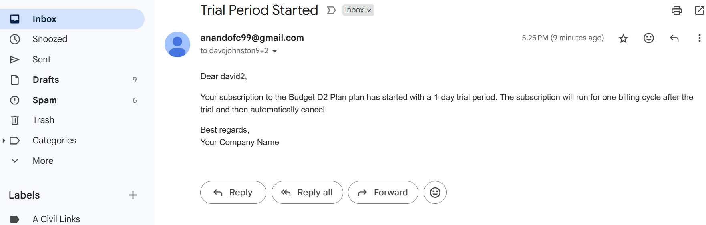
</h2>

<h1>Errors - After Upgrading a project plan the old plan all the lower plans should be unavailable - need fix replace this image</h1>

 <strong>New Active Platform Plan</strong>

<h2 align="center">

</h2>

<h1>Errors - After Upgrading a project plan the remaining is not calculating correctly - need fix replace this image</h1>

 <strong>The Correct New Number of remaning Projects</strong>

<h2 align="center">

</h2>

- Use Case: Cancel a Platform Product.  

  1. Click on the Subscription Plans link and the Subscription page opens with your current plan, e.g. Platninum. 
  2. Click on the Cancel button and a message displays asking you to confirm delete. 
  3. Click Yes. 
  4. You are taken back to the Subscriptions page and now your new plan has a message saying that your subscription is canceled but you can use the service till the end ot the current payment cycle. 

 <strong>Confirm Delete</strong>

<h2 align="center">
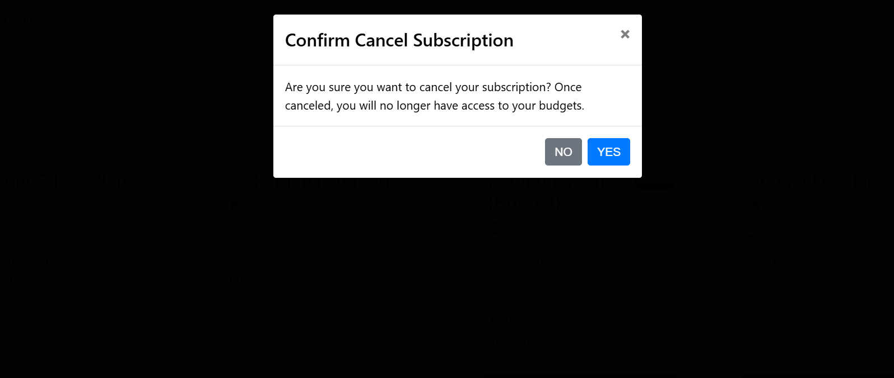
</h2>

<h1>Errors - After Canceling a budget plan the old plan should be canceled and  unavailable - need fix replace this image</h1>

 <strong>Confirm Delete</strong>

<h2 align="center">
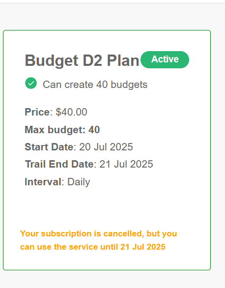
</h2>

- Use Case: Purchase separate "Budgeting Software" products.  

  1. Click on the Subscription Plans link and the Subscription page opens. 
  2. Click on a Budget Plan and the Stripe page opens. 
  3. Enter you Details but don't tick the Terms and Conditions box and submit. 
  4. A Message appears telling you to tick the box. 
  5. Tick the box and submit. 
  6. You are taken back to the Subscriptions page and now your plan is active and all lower plans are Unavailable and all higher plans have an Upgrade option 
  7. An email is sent to you advising you of your plan. 
  8. On the My Account Budget page the message displaying the correct number of remaing Budgets and the total for that plan displays correctly, e.g. 29 Budgets remaining out of 30.  

 <strong>Stripe</strong>

<h2 align="center">
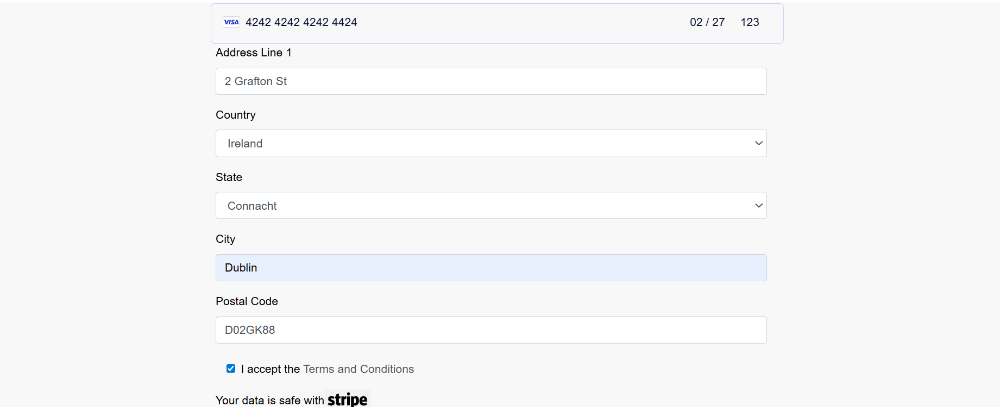
</h2>

 <strong>Active Budget Plan</strong>

<h2 align="center">
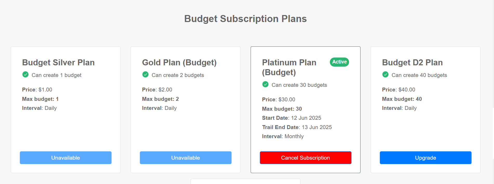
</h2>

- Use Case: Upgrade a separate "Budgeting Software" product.  

  1. Click on the Subscription Plans link and the Subscription page opens with your current plan, e.g. Platinum. 
  2. Click on a higher Budget Plan you want to upgrade to, e.g. D2, and the Stripe page opens. 
  3. Enter your Details and submit. 
  4. You are taken back to the Subscriptions page and now your new plan, D2, is active not you old one,and all lower plans are Unavailable and all higher plans would have have an Upgrade option if they were any. 
  5. An email is sent to you advising you of your new plan. 
  6. On the My Account Budget page the message displaying the correct number of remaing Budgets and the total for that plan displays correctly, e.g. 39 Budgets remaining out of 40.  

<h1>Errors - email wording error - need fix replace this image</h1>

 <strong>Upgrade Email</strong>

<h2 align="center">

</h2>

<h1>Errors - After Upgrading a budget plan the old plan should be canceled and  unavailable - need fix replace this image</h1>

 <strong>New Active Budget Plan</strong>

<h2 align="center">

</h2>

- Use Case: Cancel a separate "Budgeting Software" product.  

  1. Click on the Subscription Plans link and the Subscription page opens with your current plan, e.g. Platinum. 
  2. Click on the Cancel button and a message displays asking you to confirm delete. 
  3. Click Yes. 
  4. You are taken back to the Subscriptions page and now your new plan has a message saying that your subscription is canceled but you can use the service till the end ot the current payment cycle. 

 <strong>Confirm Delete</strong>

<h2 align="center">

</h2>

<h1>Errors - After Canceling a budget plan the old plan should be canceled and  unavailable - need fix replace this image</h1>

 <strong>Confirm Delete</strong>

<h2 align="center">

</h2>

### The Account Page
Description: When My Account is clicked on in the Navbar the user's Account page opens. It will show all the user's Projects and a link to the user's Budgets. It will tell how many Projects are left on the subscription and have a "Create Projects button. 

- Use Case: View "Platform" Projects.  

  1. Click on the My account link and the Account page opens. 
  2. The User's "Platform" projects and separate "Budgeting Software" products are displayed. 
  3. The new project is displayed below.

 <strong>xxx</strong>

<h2 align="center">

</h2>

- Use Case: Create and purchase "Platform" projects.  

  1. Click on the My Account link and the Account page opens. 
  2. Use the "Create Project" feature to create and purchase new "Platform" projects. 
  3. The new project is displayed below.

 <strong>xxx</strong>

<h2 align="center">

</h2>

- Use Case: Create and purchase separate "Budgeting Software" products.  

  1. Click on the My Account link and the Account page opens. 
  2. Use the "Create Budget" feature to create and purchase new "Platform" "Budgeting Software" products. 
  3. The new product is displayed below.

 <strong>xxx</strong>

<h2 align="center">

</h2>

- Use Case: Edit User profile.  

  1. Click on the My Account link and the Account page opens. 
  2. Click the 3 Dots and a menu appears. Select Edit profile. 
  3. Enter the new info and an image and submit. 
  4. The new info and image display. 

 <strong>New Info</strong>

<h2 align="center">

</h2>

 <strong>New Info Displays</strong>

<h2 align="center">

</h2>

- Use Case: Edit Username.  

  1. Click on the My Account link and the Account page opens. 
  2. Click the 3 Dots and a menu appears. Select Change Username. 
  3. Enter the new username and submit. 
  4. The new username display correctly and on logging oit and signing in with that username the user is taken to the Home page. The old user name no longer is valid. 
  5. This has no effect on the usernames for projects.

 <strong>New Username</strong>

<h2 align="center">

</h2>

 <strong>New Username Displays</strong>

<h2 align="center">

</h2>

### The Chat page
Description: This allows users to add and view Chats. It also has a link to the Profiles page which contains all existing users and the ability for the user to follow them. In doing so the user will create their feed of posts from their followed users. It is intended to build a community for the users of the app where they can share their thoughts and experiences and promote themselves and in return the actual software itself. 
First time and returning users who are trying to find out about the software and deciding whether or not to purchase a product can browse all the Chat messages from users who are already using the software, along with their comments, in the Chat feature. This will give the user a real unfiltered idea about the actual realtime use of the app.  

- Use Case: View Chats.  

  1. Click on the Chat link in the Navbar and the Chat page opens. 
  2. View the Chat messages.

 <strong>xxx</strong>

<h2 align="center">

</h2>

- Use Case: Add a Chat.  

  1. Click on the Chat link in the Navbar and the Chat page opens. 
  2. Click on the "Add Chat" tab and the Add Chat form opens. 
  3. Fill in the form and submit.  

 <strong>xxx</strong>

<h2 align="center">

</h2>

- Use Case: Add a Comment.  

  1. Click on the Chat link in the Navbar and the Chat page opens. 
  2. Click on a Chat message and it opens. 
  3. Fill in the comment form and submit.  
  4. The Comment is displayed on the page.  

 <strong>xxx</strong>

<h2 align="center">

</h2>

- Use Case: View Profiles.  

  1. Click on the Chat link in the Navbar and the Chat page opens. 
  2. Click on a Profiles tab and the Profiles page opens. 
  3. All the Profiles display.  
  4. Click on one to view its details and Chats.

 <strong>xxx</strong>

<h2 align="center">

</h2>

- Use Case: Follow a Profile.  

  1. Click on the Chat link in the Navbar and the Chat page opens. 
  2. Click on a Profiles tab and the Profiles page opens. 
  3. All the Profiles display.  
  4. Click the  "Follow" or "Unfollow" tab to follow or unfollow a profile. 

 <strong>xxx</strong>

<h2 align="center">

</h2>

### Stripe ????????????????????
Description:  

- Use Case:   

  1. Cmm 
  2. mmm 
  3. mmm

  Stripe is used for the payment system. On selecting a product the User will be brought to the Stripe payment page.
   For the "All in One Platform" this feature will take the User's details and after a Free trial period will take a monthly payment if the User does not cancel. For the separate "Budgeting Software" it will take the whole sum after a Free Trial period if the User does not cancel. It also allows the user to cancel at any time.

 <strong>xxx</strong>

<h2 align="center">

</h2>

<!-- ### Testing Stripe Card and Details Input Errors

If incorrect details or there are required boxes not filled in an error message will display.

<strong>Missing Details</strong>

<h2 align="center">

</h2>

<strong>Incorrect Card Number</strong>

<h2 align="center">

</h2>

### Testing Stripe Two-step authentication

The testing method for Two-step authentication was used and it proved successfully. 
The card number for this is 4000 0000 0000 3220.

<strong>First Fail was Selected then Complete</strong>

<h2 align="center">

</h2>

<strong>Fail Result</strong>

<h2 align="center">

</h2>

<strong>Complete Result</strong>

<h2 align="center">

</h2> -->

### Responsive Design
Description: The site is responsive to all screen sizes and the images respond in proportion. br>

- Use Case: xxx  

  1. xxx 

 <strong>Large Screen</strong>

<h2 align="center">

</h2>

 <strong>Small Screen 320px</strong>

<h2 align="center">

</h2>

## User Stories Testing
Note: Functional aspects of some User Stories are covered in the Features Testing section. [Features](#features-testing)

### First Time User Goals

1. #### As a First Time User, I want to learn what the site has to offer and how to navigate the site quickly.

    - The Landing/Home page is split into three sections. The first informs the user as to the nature of the site and what it offers, an "All in One" Film, TV and Video Production Software platform and "Budgeting Software" as a individual product. 
    It then lists the software's features under the Creative and the Production side headings. These can be clicked on to take the user quickly to the information page for that feature. 
    The second section gives a brief easy to understand overview of what the software does and what it can be used for. 
    At the top of every page the Navbar displays all options for the user so they can select their desired destination quickly. 

<strong>Landing Page and Navbar</strong>
   
<h2 align="center">

</h2>

2. #### As a First Time User, I want to view information on the different features of the software.

    - The third section of the home page gives a brief summary of the above mentioned features and when again clicked on, as with the links in the image, take the user to that feature's information page. These pages give a clear easy to understand explanation of the feature with actual images of the software. Links to these pages can again be found in the Navbar.

<strong>Feature's Information Page</strong>
   
<h2 align="center">

</h2>

3. #### As a First Time User, I want to register an account easily.

    - The user will be given the option to Register immediately by a link at the bottom of the landing page image and in the Navbar. On clicking they will be taken to the Register Page and only have to enter a username and password to sign up. See Features Testing for more. 

[Back to README](/README.md)

### Returning User Goals

1. #### As a Returning User, I want to easily login and logout.

    - The user can login and logout easily from the My Account nav link. 
    The site also includes a feature that keeps a user signed in for 24 hours so they don't have to go to the trouble of signing in if they are using it regularly. See Features Testing for more.

2. #### As a Returning User, I want to view or update my profile.

    - On clicking on the My Profile tab in the My Account Navbar the User is taken to their Profile Page where they can view and update their Profile details.

<strong>xxxxxxx</strong>

<h2 align="center">

</h2>

3. #### As a Returning User, I want to see what people are saying about the app and know if it is professional and trustworthy.

    - The user can view reviews and testimonials from registered users on the Testimonials page, which is easily accessible from a link in the Navbar. Positive, short and concise lines from these will also be added to the landing page to immediately make an impact on the user. 
    The user can also browse all the Chat messages from users who are already using the software, along with their comments, in the Chat feature. This will give the user a real unfiltered idea about the actual real-time use of the app. 

<strong>xxxxxx</strong>

<h2 align="center">

</h2>

4. #### As a Returning User, I want purchase products easily.

    - Once the user has Registered whenever they login their My Account link will display in the Navbar. On going to their Account page the user will immediately see the "Create Project" and "Create Budget" features with a brief summary of each product above it.   It also contains a concise explanation of what happens when a product is created and how the user should proceed.
     The Create Project is for the "All in One Platform" and the user can choose which version, the Film, TV or Video/Short production software, best suits their project using the summary above to guide them. The Create Budget is for the Budgeting software. Both the Projects and Budgets will have a discounted student version and the Projects have a one month free trial both of which are designed to create more sales. 
    Once the user selects a product they will be taken to the Stripe page to complete the transaction. And once the sale goes through the user will receive an email confirming the purchase and containing the project details. These detail include the Project URL and the user's username and password. 
    Lastly the project or Budget will now display on the user's account page with its URL. See Features Testing for more.

<strong>xxxxxx</strong>

<h2 align="center">

</h2>

[Back to README](/README.md)

### Frequent User Goals

1. #### As a Frequent User, I want to view my purchased products and projects.

    - The user can easily view their purchased products and projects in their Account page, the link for which is clearly displayed in the Navbar. See Features Testing for more.

2. #### As a Frequent User, I want to easily reset my password if I forget it. ??????????

    - The user can easily reset their password by clicking the Forgot Password link which is clearly displayed on the Sign In page.

<strong>xxxxxxx</strong>

<h2 align="center">

</h2>

3. #### As a Frequent User, I want to view my order history and payment details.

    - The user can easily view their order history and payment details by click on the link for this in their account page.

<strong>xxxxxxx</strong>

<h2 align="center">

</h2>

4. #### As a Frequent User, I want to post messages and comments on the Chat page.

     - See Features Testing.

5. #### As a Frequent User, I want to easily change my password and username.

- The user can easily change their password and username by clicking on the link on their Profile page.

<strong>xxxxxxx</strong>

<h2 align="center">

</h2>

6. #### As a Frequent User, I want to use the Budgeting Software.

    - A complete breakdown of the usage and testing of this is in the Features section.

[Back to README](/README.md)

### Owner/Admin User Goals

1. #### As the Owner/Admin User I want to edit product prices and details.

    - This is easily achieved through the site's development editor and re-deployment.

<strong>xxxxxxx</strong>

<h2 align="center">

</h2> 

2. #### As the Owner/Admin User I want to add testimonials and reviews to the Testimonial page.

    - This is easily achieved through the site's development editor and re-deployment.

<strong>xxxxxxx</strong>

<h2 align="center">

</h2> 

3. #### As the Owner/Admin User I want add new testimonial lines and other marketing and sales items to the landing page.

    - This is easily achieved through the site's development editor and re-deployment.

<strong>xxxxxxx</strong>

<h2 align="center">

</h2> 

4. #### As the Owner/Admin User I want to post messages or respond to messages in the Chat feature.

    - The Owner/Admin User can easily post messages or respond to messages with new posts or comments in the Chat feature, their posts being clearly distinguishable through styling.

<strong>xxxxxxx</strong>

<h2 align="center">

</h2> 

5. #### As the Owner/Admin User I want control over material posted on the site for legal and other purposes.

    - The Owner/Admin User can delete posts and comments in the Chat feature. They can also delete Users.

<strong>xxxxxxx</strong>

<h2 align="center">

</h2> 

[Back to README](/README.md)

## Lighthouse

Lighthouse was used to test every page on desktop and mobile screens. 
To view all Lighthouse testing go to the Testing page. Issues were resolved if necessary.

 [Back to README](/README.md)